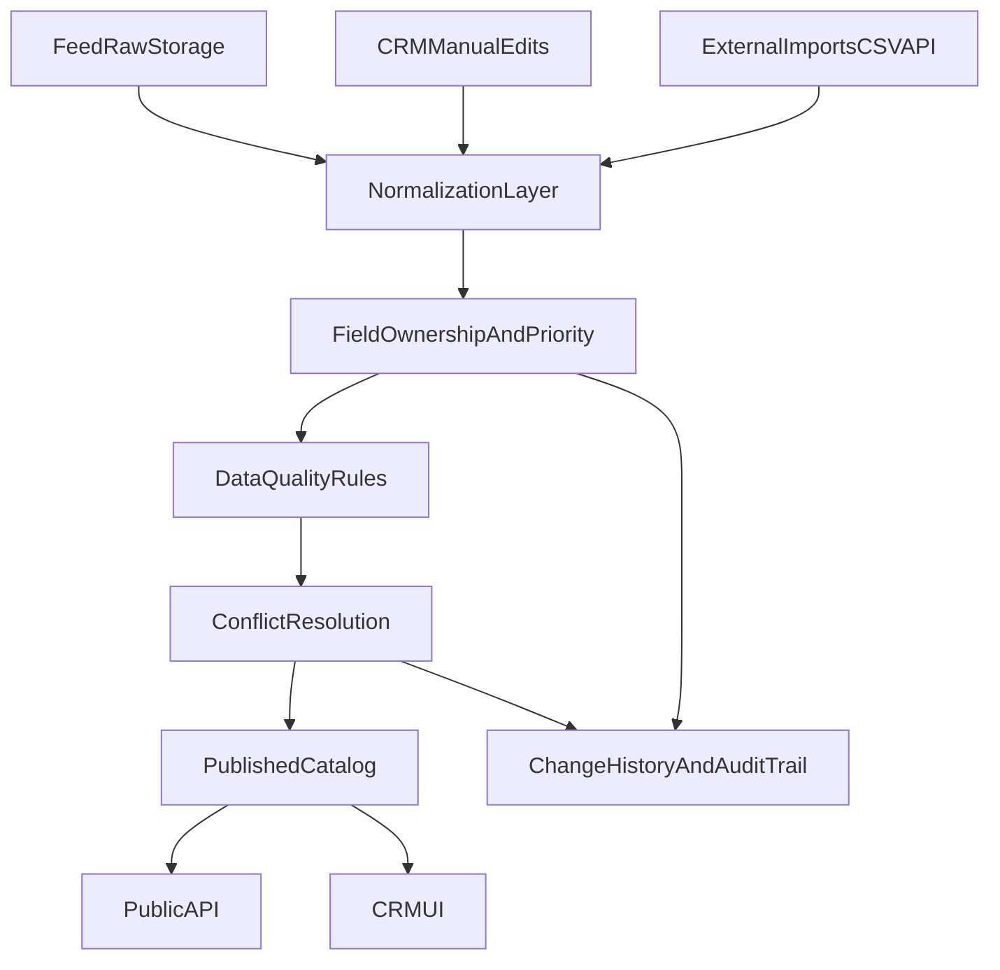

# Feed + Manual CRM Roadmap (MVP -> Advanced)

Based on: `docs/audit/2026-03-07_feed_crm_audit.md`

## Target Architecture

## Phase A (P0) - Stabilize and Make It Safe

Target: 1-2 weeks.

### A1. Sync outcome transparency
- Update `FeedSyncService::sync()` return contract:
  - `status`: `success | skipped | failed`
  - `reason`: e.g. `lock_held`
  - `stats` and `duration_seconds`.
- Update `FeedSyncCommand` output to explicitly show skip/failure reasons.
- Update CRM feed run API (`CrmFeedController`) to return real exit code/status, not hardcoded success.

### A2. Validation gate before DB upsert
- Add feed quality validator service:
  - required keys
  - FK existence precheck for critical refs (`district_id`, `subway_id`, `building_id`)
  - type guards for numeric/date fields.
- On hard violations:
  - store issue record
  - block destructive sync stage
  - emit structured log and CRM alert.

### A3. Reduce discovery noise and preserve observability
- In discovery probe mode:
  - classify 404 on probed optional endpoints as expected and log at `debug`.
  - keep `error` only for configured/expected endpoints failing.
- Ensure output artifacts are always complete:
  - `discovery_log.json`
  - `report.json`
  - `relationships.json`

### A4. Ownership metadata (minimal)
- Add per-record metadata columns (or sidecar table):
  - `source_type` (`feed|manual|import`)
  - `updated_by_type` (`system|user`)
  - `manual_override` boolean
  - `last_feed_sync_at`.
- At sync time, respect manual override for protected fields.

## Phase B (P1) - Build Real CRM Core

Target: 3-6 weeks.

### B1. Typed entity forms (no JSON prompts)
- Replace JSON prompt editing in catalog/dictionaries with typed forms.
- Add field-level validation messages and dependent-field behavior.
- Add safe defaults and destructive action confirmations.

### B2. Lifecycle workflow
- Add statuses:
  - `draft`, `in_review`, `approved`, `published`, `archived`.
- Enforce role matrix for transitions.
- Public API should read only `published`.

### B3. Change history and rollback
- Introduce audit tables:
  - `entity_revisions`
  - `entity_change_events`.
- Persist before/after patch, actor, source, timestamp.
- Add rollback endpoint for selected revisions.

### B4. Conflict center (feed vs manual)
- During sync, compute diffs for overridden/manual fields.
- Provide CRM UI to:
  - keep manual value
  - accept feed value
  - merge per field.

### B5. Bulk operations
- Multi-select update for:
  - activation/status
  - position
  - tags/folders/media links
  - publish state.

## Phase C (P2) - Advanced Managed Platform

Target: 6-12 weeks.

### C1. Data quality dashboard
- Metrics:
  - endpoint freshness
  - schema drift
  - null-rate per critical fields
  - FK violation trend
  - sync duration and skip/failure trend.

### C2. Automation and policy engine
- Rule-driven actions:
  - auto-archive stale entities
  - auto-prioritize hot offers
  - auto-tag by location/price bands.

### C3. Full lineage
- Per field show:
  - origin source
  - transform chain
  - last overridden by whom.

### C4. Safe import framework
- Add import profiles and dry-run preview for CSV/API imports.
- Add deterministic idempotency keys for re-import.

## Technical Work Packages

### WP-1 Backend contracts
- `app/Services/Feed/FeedSyncService.php`
- `app/Console/Commands/FeedSyncCommand.php`
- `app/Http/Controllers/Api/V1/CrmFeedController.php`
- `app/Services/Feed/FeedDiscoveryService.php`

### WP-2 CRM API shape
- `app/Http/Controllers/Api/V1/CrmCatalogController.php`
- `app/Http/Controllers/Api/V1/CrmDictionaryController.php`
- Add status/history/conflict endpoints.

### WP-3 CRM Frontend
- `frontend/src/crm/pages/CrmCatalog.tsx`
- `frontend/src/crm/pages/CrmDictionaries.tsx`
- `frontend/src/crm/pages/CrmFeed.tsx`
- Add dedicated pages: `CrmConflicts`, `CrmHistory`, `CrmQuality`.

## Acceptance Criteria

### For Phase A
- `feed:sync` clearly reports skipped runs and reasons.
- Failed FK/type validations are visible in CRM and logs.
- Discovery run produces complete artifact set with low-noise logging.
- Manual-overridden fields are not overwritten by sync.

### For Phase B
- No JSON prompt editing remains in core catalog workflows.
- Every data mutation has actor + revision trail.
- Publish workflow is enforced by role and status.
- Conflict resolution UI is operational for feed/manual collisions.

### For Phase C
- DQ dashboard and alerts are active with historical trends.
- Automation rules can be configured without code changes.
- Field-level lineage is available in CRM.

